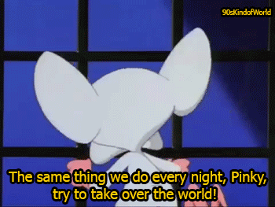

:title The Open Source Startup
:author Chris Gwilliams
:description Work smart, work free (as in speech)

.. role:: bash(code)
   :language: bash
.. role:: py(code)
   :language: python
.. role:: vue(code)
   :language: html

The Open Source Startup
=======================
Chris Gwilliams
---------------
gh: @encima tw: @encima27
~~~~~~~~~~~~~~~~~~~~~~~~~

https://github.com/encima/open_source_startup

-----

What?
=====

 Creating a startup is not a cheap thing to do, nor is it quick.
 If you have the latest tech idea but no idea how to code, or you have some idea how to code but you have no time, then you want to make the quickest MVP that can easily be added to in the future

-----

What?
=====

Today, I will argue that you **CAN** create software with **SOME** knowledge quickly, ethically, easily and...cheaply.

-----

.. figure:: img/huh.gif

-----

Who?
====

-----

:data-y: r-800

Who?
====

Me? I am just an awkward moron with opinions. But....who isn't?

I have worked with companies in industry, freelanced and worked in universities for 8 years. My main role has always been to be on the very edge of technology in the field I work in: data and sensors.

-----

:data-y: r-400

Who?
====

Because this field crosses so many others, this also means I need to stay ahead in:

* Databases
* Web
* Mobile

Yep, you guessed, the three main components for a hipster startup in 2019.

----

:data-y: r0

Why?
====

Now, when people ask for help, I can give them this presentation and walk away.

But really, I love the open source community and the tools and specifications being developed right now are exciting for people both inside and out of the tech world.

-----

So?
===

So, I will do today what I hate doing most of all:

* Preaching
   * Some advice on building a company and tools
* Over using GIFs
   * and incorrectly calling them JIFs
* Saying hipster phrases
* Live coding
   * Building a startup of your choosing

-----

Preach It!
==========

------

Some Disclaimers
=================

* Take it or leave it!
* I have no idea what I am talking about
* These are just my obversations
* Some of them are more focused on less technical founders

-----

General
=======

* The only person working for free is the one with the idea
* If you believe in it: pay for it (with time and/or money)
* Planning and preparing is a job in itself
* It is never too early to sweat the small stuff
* Never create more than you need
* Know when to let go

.. note::

   Often the extra bits you want to make are not needed at the start and could become your business model.

   Letting go normally means control. It is still your baby if you give the frontend to a different company etc.

-----

Technical
==========

* Latest is not always the best
* Be critical in your decisions (i.e. do not trust HN, Product Hunt)
* Endorsement from friends are great but benchmarks are better
* Building up is often harder than building out

-----

If You Are Not Technical
=========================

* Trust your developers **
* Project management is vital and you can do it
* If you create a hierarchy, you create a problem
* One tool to do all is often worse than separate products
   * But reduce the number of products
* Slack is worse than MSN Messenger
* Learn Git
   * Failing that: learn Github (read code, know what a PR is, use the projects)
* Your idea may be closed source, but your work does not have to be
* Smaller is better and solo is OK

-----

</preach>
==========

-----

TECH BIT
=========

First...I need a startup idea.

Don't worry...You can keep your 'Store your food diary on the blockchain', just a **SIMPLE WEB IDEA**

-----

Thanks
=======

So, we have 3 things to build and a **METRIC CRAP TON** of ideas within that.

Before we face all these ideas, let's get rid of a few:

-----

Blockchain ANYTHING
====================

-----

MongoDB
========

.. note::

   Notice how I did not say NoSQL? Fine by me

------

Closed Source
==============

.. note::

   This does not include your project management crap

-----

Databases (Or...Why Postgres?)
===============================

Really, Postgres does not matter, you have a bunch of options.

Only creating a mobile site? **SQLite**
Relational data? **MySQL/Postgres/Maria**
Crap ton of Data/Fast pipeline? **Cassandra**
Not sure? **Not Mongo**

-----

Run it!
==========

.. code:: shell

  version: '3.1'

services:

  db:
    image: postgres
    restart: always
    environment:
      POSTGRES_PASSWORD: chiaseeds
      POSTGRES_USER: organic_almond_milk
      POSTGRES_DB: bikehike
    ports:
      - 7000:5432

-----

Backend
========

Before we look at tools, let's look at (3) technologies...

1. Websockets
   A great technology but mainly for quite specific purposes. Message me if you want help with tools for this.

-----

Backend: REST
==============

* REpresentational State Transfer
* The most common (and popular) web tools with use this

Pros:
   * Defined standard: https://www.w3.org/2001/sw/wiki/REST
   * Massive set of tools
   * All browsers get it
   * About as **semantic** as you can get

Cons:
   * Some parts open for interpretation
   * Developers can fight for days over it
   * There is a lot of boiler plate code
   * Custom code must be written for specific things (i.e. Edit Tweet)

-----

REST
=====

* GET (/model?search):

.. code:: python

   def get_model(search_terms):
      yay = get_models_from_db(search_terms)
      if yay:
         return yay, 200
      else:
         return 'nay', 404

-----

* POST (/model):

.. code:: python

   def create_model(model):
      yay = create_model(model)
      if yay:
         return yay, 201
      else:
         return nay, 500

-----

* PUT (/model/id):

.. code:: python

   def update_model(id, model):
      yay = update_model(model)
      if yay:
         return yay, 201
      else:
         return 'nah', 404 | 500 | 400 etc

-----

* DELETE (/model/id)

.. code:: python

   def delete_model(id):
      yay = delete_model(id)
      if yay:
         return 'GONE', 200
      else:
         return 'NOPE', 401

-----

But We All Knew That Right?
===========================

Tools...SO. DAMN. MANY.

1. You need an API. Always.
2. You want people to be able to use your API
3. You don't want to write the same crap in your code and your docs
4. You don't want to write docs.

-----

OpenAPI
========

There really is only one option:

.. code:: yaml

   openapi: "3.0.0" (latest version, v2 is called Swagger)
   info:
      title: A plain text API description? WHAT!
      version: 0.0.1
   servers:
      - url: https://emancipated-badger.io
   paths:
      /badgers:
         get:
            summary: list all badgers
            operationId: getBadgers
            tags:
               - pets
            parameters:
               - name: emancipated
                 in: query
                 description: is the badger emancipated?
            response:
               '200':
                  description: ALL the badgers

-----

Why?
====

https://swagger.io/tools/

* Generate a server with boilerplate code
* Generate clients in (almost) any language
* Write the spec even if you are not technical
* Pretty rigid guidelines
* Instant documentation AND playground
* Client and server **always** in sync
* Versioning
* Built in support for common authentication

-----

Servers: Connexion (Python)
============================

.. code:: python

    app = connexion.FlaskApp(__name__)
    app.add_api('openapi.yaml')
    app.run(port=8081, use_reloader=False, threaded=False)

-----

Backend: GraphQL
=================

Closely couple your database with your frontend using a language that the bastard child of JavaScript and SQL: GraphQL.

Pros:

* Closer coupling to the database
* Integrates very well with web frameworks
* One single endpoint
* All the logic is in the call
* Your schema is your documentation

Cons:

* Made by Facebook (I know)
* Hipster as shit
* Still in early stages
* Unless you provide an SDK, devs need to know GraphQL
* If you are making a tool to integrate with others, i.e. Evernote, do not use GraphQL...yet

-----

Hasura
=======

.. code:: bash

   wget https://raw.githubusercontent.com/hasura/graphql-engine/master/install-manifests/docker-compose/docker-compose.yaml
   docker-compose up -d #DONE! WHAT?!?

-----

GraphQL - Queries
==================

* Get some data

.. code::

   query Horses($name: String!, $id: uuid!) {
      horses(where: {name: {_eq: $name}, id: {_eq: $id}}) {
        id,
        name,
        description
      }
    }

-----

GraphQL - Mutations
====================

* Mess with some data

.. code::

	mutation register_user($objects: [users_insert_input!]!) {
			insert_users(objects: $objects) {
				returning {
					id
					api_key
					username
					email
				}
			}
		}

-----

OK, choose one and let's make it for our startup...

-----

Frontend
=========

* So much to choose from...Pros and Cons for all
* TL;DR look at the libraries available and choose one that works best
* DO NOT SWITCH TOOLS HALFWAY THROUGH AND DO NOT HIRE <Framework> devs, just front end devs: https://frontendmasters.com/books/front-end-handbook/2018/practice/skills.html
* Expectations for frontend devs have **skyrocketed** in the past 10 years
* Expect learning time, document onboarding as much as possible (at every stage of your company)
* Teaching is a job in itself...allow for that

-----

VueJS
======

* Easy
* Community supported
* Not backed primarily by one company
* Correctly versioned (I am looking at you...Angular)
* Standard tools and nice CLI
* Unopinonated

-----

Go Go GO
=========

.. code:: bash

   npm i -g @vue/cli
   vue create bikehike
   cd bikehike; npm run serve

-----

Quick Overview
==============

Vue has a:

* main.ts/js file: This is where the app is loaded and all plugins are made
* router.ts/js file: This holds all the routes and the views they link to. You can also handle authorisation and such here.
* Components: a folder for all of your widgets
* Views: a folder for all of your pages

-----

Not a designer? Not a problem
==============================

.. code:: shell

  npm i vue-material
        vuetify
        vuikit

https://madewithvuejs.com/frameworks

-----

Components and Views
=====================

**Components** are like the login form on a site or the results table. Using as many components as possible means you can reuse them throughout your application.

**Views** are the pages themselves, such as an Account page or an Item listing page.

-----

First Component
================

When Vue makes your app for you, it creates a **components** and **views** folder. Inside components, we see a HelloWorld.vue.

Open it up and we can modify it to be something useful.

-----

.. code:: html

  <template>
    

      <h1>{{ msg }}</h1>
      <md-list class="md-triple-line" v-for="item in bikes">
        <md-list-item>
          <md-avatar>
            
          </md-avatar>

          

            {{item.name}}
            {{item.model}}
            
{{item.description}}

          

          <md-button class="md-icon-button md-list-action">
            <md-icon class="md-primary">star</md-icon>
          </md-button>
        </md-list-item>

        <md-divider class="md-inset"></md-divider>
      </md-list>

    

  </template>

  

  <!-- Add "scoped" attribute to limit CSS to this component only -->
  

-----

Link to your backend
=====================

.. code:: javascript

   Swagger({
            url: options.swaggerURL
        }).then(client => {
          console.log('client reached');
        }).catch(err => {
          console.error('Endpoint likely not available');
        });

-----

:data-y: r0

Mobile
=======

* It is OK to make a mobile site first
* Unless your product is a device (or needs background services) then a mobile site wrapped may be all you ever need
* Native will **always** be the best route: https://medium.com/airbnb-engineering/sunsetting-react-native-1868ba28e30a
* It is OK to focus on the best platform first and then the next but do **try** for both

-----

My Choice: Flutter
===================

A framework that is basically templating with everything focused around `state` and `widgets`

Pros:

* Cross platform
* Integrates tightly with the OS
* Native performance
* No JavaScript
* Open source

Cons:

* Created by/Backed by Google
* Beyond hipster
* Devs for it will be rare for the next few years
* Uses dart programming language (similar to Java and JS but not the same)
* Small (by comparison) community

-----

Let's go mobile!
================

::

   flutter create bikehike //rent other people's bikes and hiking gear for days out
   cd bikehike
   flutter devices //list devices
   flutter run //ta-da!

-----

Add some  lists and data and such
==================================

.. code:: dart

  class BikeInfoCard extends StatefulWidget {
      final Bike bike;

      BikeInfoCard({Key key, this.bike}) : super(key: key);

      @override
      BikeInfoState createState() => BikeInfoState();
      }

   class BikeInfoState extends State<BikeInfoCard> {
      @override
      void initState() {
         super.initState();
      }

      Widget build(context) {
         // We use the widget variable to access the parent widget that owns the state
         return Text(widget.bike.name);
      }
   }

-----

.. code:: dart

   class BikeList extends StatelessWidget {
      final List<Bike> bikes;

      BikeList(this.bikes);

      @override
      Widget build(BuildContext build) {
         return ListView.builder(
            // Must have an item count equal to the number of items!
            itemCount: bikes.length,
            // A callback that will return a widget.
            itemBuilder: (context, index) {
            // In our case, a DogCard for each doggo.
            return BikeInfoCard(bike: bikes[index]);
            },
         );
      }
   }

-----

More?
=====

i.e.

* Where is the beer?
* Why did this not help?
* Does it work in Internet Explorer?
* This is not the Spanish Learning Meetup, is it?
* Do you have any self respect at all?
* What do we do now?

https://github.com/encima/open_source_startup

.. note::

  * https://getmakerlog.com/
  * https://wip.chat/
  * meetup.com
  * gitter.im

